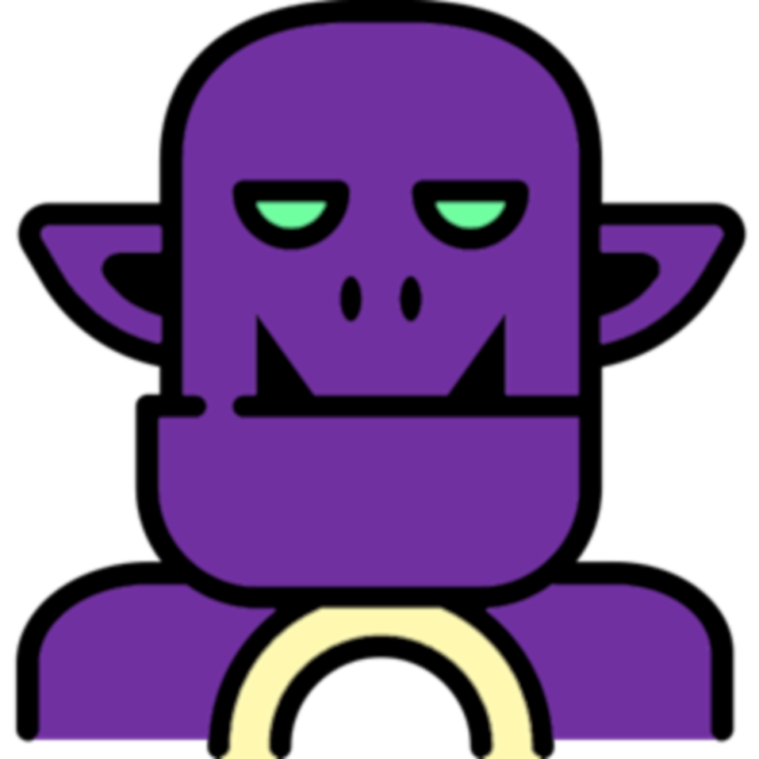
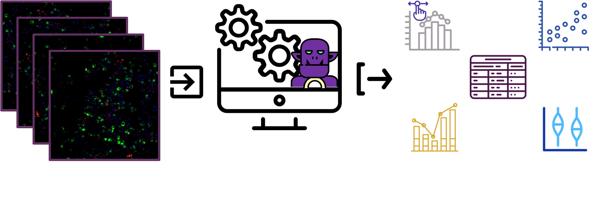

# EASI-ORC

  

The EASI-ORC pipeline can take you from raw images to analyzed data and graphs. It performs mRNA-ER colocalizaion analysis in a fast, reliable and consistent manner. All running on the Fiji platform, freely and openly.

Our [user guide](https://github.com/ShaharGarin/EASI-ORC.github.io/blob/c2f86e303f4534bf5d0a5a138059f861595184bd/EASI%20ORC%20User%20Guide.pdf) will take you step-by-step, explaining every module in detail.

[Download the scripts](https://github.com/ShaharGarin/EASI-ORC.github.io/blob/73cd76d4703f90b22be32aa0b13b25d66424044f/code/EASI-ORC%20Scripts.7z) and use them on your images.

Designed to work with NO coding.

[An example image](https://github.com/ShaharGarin/EASI-ORC.github.io/blob/247498dd5b2bfbeafa02566af1b0ed4fe2d05995/Example%20Image.7z) (with 4 channels) can be downloaded for testing and practice (with labaled ER and SUC2 smFISH signals), [as well as example segmentation calssifiers](https://github.com/ShaharGarin/EASI-ORC.github.io/blob/86da0e13a4c2d5a6897776d4283a053f489cca6d/classifiers/classifiers.7z).

  

## EASI-ORC can:
* Segment yeast cells.
* Segment organelles and other sub-cellular structures.
* Sub-segment organlles using a proximity marker.
* Identify FISH spots.
* Resolve mRNA-organelle colocalization.
* Filter, analyze and graph results.

EASI-ORC automates [YeastMate](https://yeastmate.readthedocs.io/en/latest/), [Trainable WEKA Segmentaion](https://github.com/fiji/Trainable_Segmentation?tab=readme-ov-file), and [RS-FISH](https://github.com/PreibischLab/RS-FISH) plugins.

You must install their plugins and the standalone yeastmate application to run EASI-ORC. See each plugin's page for instructions on istallation, if you're having issues.

If you use EASI-ORC in your research, please make sure to also reference the original works done to develop these plugins.

Logo art and additional graphics from [Flaticon](https://www.flaticon.com/).
